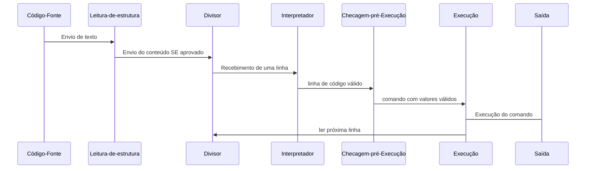

# Histora HRA
## Versão HRAwJS 1.0
**Autor:** Felipe C. Andréa
**Data:** 10 de Setembro, 2025

### Prefácio
A linguagem **Histora** (HRA) foi desenvolvido em principio como uma **linguaguem cómica** em contextualização aos eventos históricos importantes 
a **Era Antiga, Média, Moderna e Contemporânia**, 
retratando os comandos conhecidos da programação como referências aos eventos, classes sociais, revoltas etc. O desenvolvimento se baseia 
em pretexto da narração da história global durante o desenvolvimento da programação, destacando em princípio o próprio entendimento da situação
de cada evento comparado ao código que está sendo substituido

Esta documentação serve como guia completo para compreender a estrutura, sintaxe e funcionamento da linguagem, desde os conceitos mais básicos até recursos avançados.

Muitas linguagens de programação, PHP, Java, Python, JavaScript etc possuem alto desenvolvimento em produtividade de projetos, contudo em maioria apresentam conceitos e comandos muito minimalistas, ou seja, uma falta muito grande de áreas da tecnologia de desenvolvimento de projetos com identidade cultural clara, que seja divertida e educativa ao mesmo tempo. JS é ótimo, mas genérico; Python é didático, mas não traz narrativas; nenhuma linguagem conecta programação com história global de forma prática e criativa, junto a linguegem base de desenvolvimento JS, Histora busca desenvolver uma linguagem de programação em cumprir as reqisições informadas, em resumo: criativa, cômica, informativa, narrativa histórica e cultural.

A priorização do desenvolvimento trata-se da indentação a cada protocolo, comando ou expressão, possuindo propósitos e funções diferentes, tenha novos modos de instanciação referenciadas a momentos históricos ocorridos, sendo eles uma relação explicitamente ou implicitamente, em principio de quanto mais elevado o nível de aprendizado a esse comando, mais se aproxima a eventos históricos específicos, como de variáveis simples à classes sociais para funções à periodo das Grandes Navegações com a colonização.

A linguagem se concentra no público iniciante de programação, acresentado aqueles que curtem o estudo da história mundial, com nível básico de conhecimento de todas as épocas da história mundial para o entendimento completo e coerente da linguagem.

### Introdução
A HRA nasceu da necessidade de introduzir conceitos históricos em estruturas programáveis, permitindo aos desenvolvedores simulem, organizem e representem eventos históricos dentro de um paradigma lógico e formal. 

A filosofia da HRA se apoia na crença de que a História é um sistema de eventos interconectados. Assim, cada recurso da linguagem é inspirado em estruturas narrativas e fatos históricos, refletindo não apenas aspectos técnicos, mas também culturais.

__________________

### Arquitetura

| Fluxo de execução |
|-------------------|
| **Código-Fonte** → Leitura-de-estrutura → Divisor → Interpretador → Checagem-pré-Execução → Execução → **Saída**|

* **Leitura-de-estrutura** → garante que o código escrito esteja com a formatação e padrão de código da linguagem estejam coerentes ao código

* **Divisor** → quebrar o código escrito em linhas separadas

* **Interpretador** → responsável pela divisão dos tokens principais a cada linha

* **Checagem-pré-Execução** → reponsável pela avalização final da linha a qual linha esteja todos os valores necessários à execução

* **Execução** → processo real da função escrita pelo comando da linha, recebendo os valores válidos anteriormente para a execução

* **Biblioteca padrão** → funções básicas, estruturas de dados, utilitários.

### Diagrama

__________________

### Especificação da Linguagem

1. **Estrutura Básica**
Um programa em **HRA**, assim como a maioria das outras linguagens, é composta por **declarações e instruções**.

Cada instrução deve estar válida a estrutura única do HRA, o **Register Sensitive**, trata-se da necessidade de que:
* Todo início de comando precisa estar **Maiúsculo** *(mesmo que ao instanciar uma variavel anteriormente esteja em minúsculo)*;
* Todo fim de comando deve ser fechado com `,`;

Comentários são feitos conforme o padrão do **JavaScript**, `//` para comentar uma linha ou `/* ... */` para comentar múltiplas linhas.

* Exemplo
> // Primeiro programa em HRA
> 
> Work "Hello World!",

2. **Sintaxe**
Palavras-chave/comandos consistem em **case-sensitive**, tal que não podem ser usadas como nomes de variáveis.

Comandos dentro de comentários não afetam a execução.

* **Palavras-chave reservadas:**

`burgher, noble, serf, revolt, event, alias, do, work, trade, deal, but, raid, war, pirate, history, colony, ... `

3. **Tipos de Dados**

* **(Número)** `Burgher` → *10, -5, 0.3 ...*;
* **(String)** `Serf` → *"Roma", "Guerra dos 100 anos" ...*;
* **(Booleano)** `Revolt` → *true, false*;
* **(Data)** `Event` → *'1066-03-26','1918-11-11' ...*;
* **(Constante)** `Noble` → *Valores compatível a qualquer tipo de variável anterior*;

* Exemplo
> Self acontecimento do "Fim da Primeira Guerra Mundial",
> 
> Burgher ano do 1918,
> 
> Revolt FimDaGuerra do true,
> 
> Event data do '1918-11-11',
> 
> Noble imperador do "Otto von Bismark",
